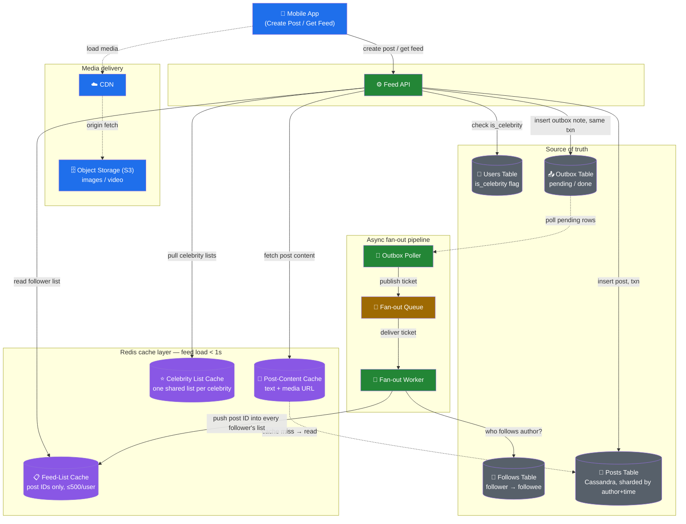
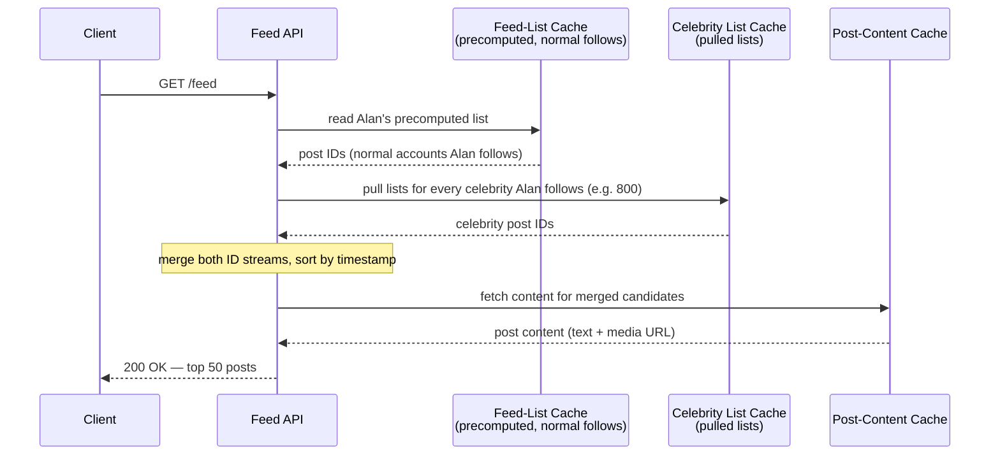
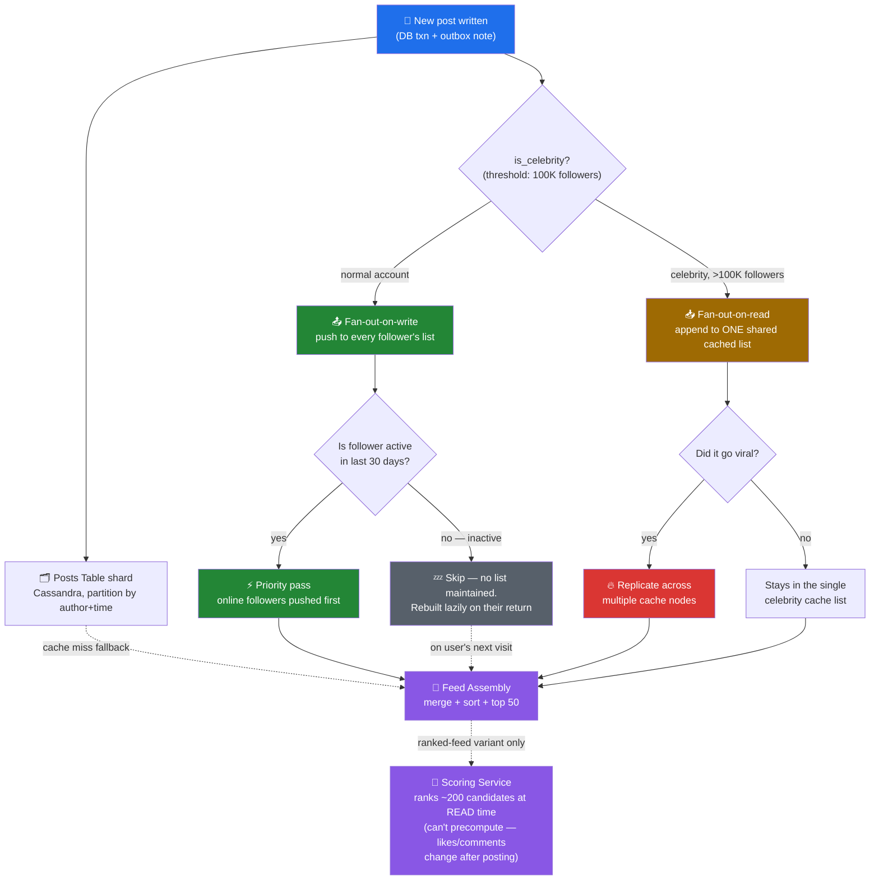
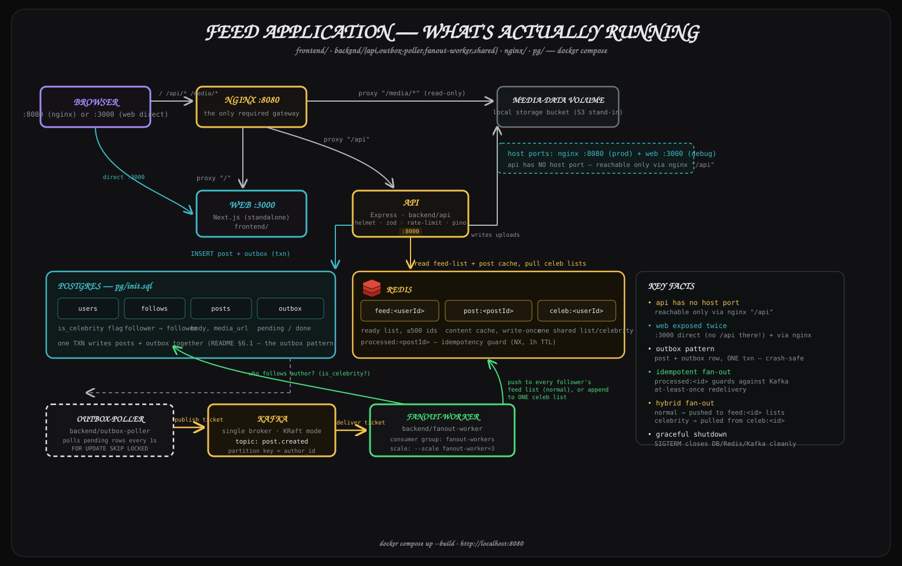

# News Feed — System Design Notes

A news feed is the general pattern behind LinkedIn's home feed, X's timeline, or Instagram's feed: an endless, sorted list of posts from accounts you follow. This document captures the full design walkthrough — requirements, scale, high-level design, the fan-out flows, and the bottlenecks/scaling follow-ups.

This document is self-contained — every diagram below is plain Mermaid embedded directly in this file.

---

## 1. Requirements

**Functional**
- Users can follow other accounts.
- Users can create posts (text, image, or video).
- Users can read a feed: newest post first, from only the accounts they follow (no ranking algorithm — pure reverse-chronological).

**Non-functional**
- Feed must load in **< 1 second**.
- A new post must reach followers' feeds within **a few seconds** (not minutes).
- An occasional **duplicate post after a refresh is acceptable** — this relaxation is what allows a much simpler, faster design later on.

**Explicitly out of scope:** a ranking/relevance algorithm (addressed only as a follow-up extension, see §6.3).

---

## 2. Back-of-envelope estimation

| Metric | Value |
|---|---|
| Daily active users (DAU) | 10,000,000 |
| Feed opens per user/day | 5 |
| Feed reads/day | 50,000,000 → **~600 reads/sec** avg |
| Posts per user/month | 3 |
| Posts/month | 30,000,000 → ~1M/day → **~12 writes/sec** avg |
| Read : Write ratio | **~50 : 1** |

**Conclusion: this is a read-heavy system.** Every design decision below optimizes the read path first, because that's where >98% of the traffic lives.

---

## 3. API surface

Two endpoints carry the whole design (likes/comments/follow endpoints exist in a real product but are out of scope here):

- **`POST /createPost`** — client sends post content; server persists it and returns a post ID.
- **`GET /feed`** — server returns the top 50 posts (newest first) from everyone the caller follows.

## 4. Data model

| Table | Shape | Access pattern |
|---|---|---|
| **Users** | user_id, name, profile, **is_celebrity flag** | point lookups |
| **Follows** | follower_id, followee_id | "who does X follow?" (feed building) **and** "who follows X?" (fan-out) — both directions matter, and the second one becomes the hottest query in the whole system once fan-out-on-write is introduced |
| **Posts** | post_id, author_id, content, timestamp | organized by author + time ("give me John's latest posts") |

At 10M users × ~200 follows each, the Follows table alone is ~2 billion rows.

---

## 5. High-Level Design

### 5.0 Architecture diagram



### 5.1 Naive approach: fan-out-on-read (rejected)

On every `GET /feed`:
1. Query Follows for who the user follows (e.g. 300 accounts).
2. Query Posts for recent posts from all 300 accounts.
3. Merge in memory, sort by time, return top 50.

**Why it fails at scale:** 600 reads/sec × (1 Follows query + ~300 Posts lookups) ≈ **180,000+ DB operations/sec**, 5× that at peak. Nearly all of this work is wasted — most users refresh and find almost nothing new, yet the entire feed is rebuilt from scratch every time. Adding read replicas just multiplies the same wasteful query; it doesn't remove the waste.

### 5.2 The fix: fan-out-on-write (precompute the feed)

Core idea: **build the feed when a post is written, not when it's read.** Don't rebuild from scratch — incrementally insert the one new post into every follower's already-built list.

- Each user has a small list (**Redis**, in-memory, for sub-second loads) holding **post IDs only**, newest on top, capped at **~500 entries**.
- A background worker takes every new post and pushes its ID onto the lists of all the author's followers.
- The source-of-truth tables (Users, Follows, Posts) don't change — they remain authoritative; Redis is a derived, rebuildable index.

Because feed lists store only post IDs, a **second cache** (post-content cache) stores the actual text/media so the same popular post isn't re-fetched from the DB for every one of its hundreds of readers.

**Read path (steady state):**
1. `GET /feed` → read the user's list from the feed-list cache (post IDs).
2. Fetch each post's content from the post-content cache.
3. On a cache miss, fall back to the Posts table and backfill the cache.
4. Return top 50.

This keeps both the read path and the write path cheap and bounded, which is what makes <1s loads and few-second propagation achievable at this scale.

---

## 6. Deep Dives

### 6.1 The Outbox Pattern (reliable fan-out trigger)

```mermaid
sequenceDiagram
    participant Client
    participant API as Feed API
    participant DB as Posts + Outbox (txn)
    participant Poller as Outbox Poller
    participant Queue as Fan-out Queue
    participant Worker as Fan-out Worker
    participant Follows as Follows Table
    participant FeedCache as Feed-List Cache (Redis)

    rect rgb(30, 60, 100)
    note over Client,DB: Synchronous write path (one DB transaction)
    Client->>API: POST /createPost
    API->>DB: BEGIN
    API->>DB: INSERT post (id=71, author=John)
    API->>DB: INSERT outbox row {post_id:71, status:pending}
    DB-->>API: COMMIT
    API-->>Client: 201 Created (post id 71)
    end

    rect rgb(50, 40, 20)
    note over Poller,FeedCache: Async fan-out (outbox → queue → worker)
    loop every few seconds
        Poller->>DB: SELECT WHERE status = pending
        DB-->>Poller: row {post_id:71}
    end
    Poller->>Queue: publish ticket "post 71 by John"
    Poller->>DB: UPDATE outbox SET status = done
    Queue->>Worker: deliver ticket
    Worker->>Follows: who follows John?
    Follows-->>Worker: 800 followers
    loop for each of 800 followers
        Worker->>FeedCache: push post 71 (skip if already present — idempotent)
    end
    Worker->>Queue: ack ticket
    end
```



**Why it matters:** if "save the post" and "enqueue a fan-out job" were two separate writes to two separate systems, a crash between them would silently drop the fan-out — the post would exist but nobody's feed would get it. Writing the outbox row in the *same transaction* as the post makes the handoff atomic. The idempotency check (skip if the post ID is already in the list) protects against a redelivered ticket double-pushing — any duplicate that still slips through is acceptable per the relaxed refresh requirement (§1).

### 6.2 The Celebrity Problem (hybrid fan-out)

**Problem:** if a celebrity with 100M followers posts, fanning out means writing the same post ID into 100M lists — an operation that can take minutes, much of it wasted on users who won't open the app for days.

**Solution: hybrid fan-out, split by follower count.**
- Threshold: **100,000 followers**. Accounts above it get `Users.is_celebrity = true`.
- **Normal accounts → fan-out-on-write (push).** Posting triggers the outbox → worker → push-to-follower-lists flow from §6.1.
- **Celebrity accounts → fan-out-on-read (pull).** Their posts are *not* pushed anywhere. Each celebrity gets **one shared Redis list** of their own recent post IDs.

`GET /feed` now does two things and merges the results:
1. Read the user's precomputed list (posts from normal accounts they follow).
2. Pull the small lists of each celebrity they follow.
3. Merge both streams, sort by time, return top 50.

**Rule of thumb:** normal accounts get **pushed**, celebrity accounts get **pulled**.



**Why this scales for power users:** a user following thousands of accounts — including hundreds of celebrities — still never triggers a single database query at read time. Every celebrity's recent posts already sit in one small, shared Redis list; reading 800 of those lists is 800 cheap cache hits, not 800 DB round-trips.

**Industry terms:**
- *Fan-out-on-read* = build the feed fresh at read time.
- *Fan-out-on-write* = precompute the feed at write time.
- The production design is a **hybrid** of both.

### 6.3 Media storage (images/video)

- Post rows never store binary media — only a **URL**.
- Actual media lives in **object storage (S3)**, served to clients through a **CDN** in front of it.
- The post-content cache also stores just the media URL, not the bytes — so heavy media never touches the hot path's memory budget.

### 6.4 Database choice & sharding

- **Posts table → Cassandra.** Write-once, (almost) never updated, always read by author+time — a textbook fit for a wide-column, time-ordered store. 30M posts/month, ~360M/year and growing forever means one machine can't hold it — the table is **sharded** across Cassandra nodes.
- **Users / Follows tables → relational DB.** Small rows, real relationships, bidirectional point lookups ("who does X follow" / "who follows X") — relational databases handle this shape well.

### 6.5 Optional extension: ranked (non-chronological) feed

If product wants relevance ranking instead of newest-first:
- **Unchanged:** the 3 source tables, the queue, the fan-out workers, the post-content cache.
- **New:** take the newest ~500 post IDs from the user's list, add in the celebrity candidates, and hand all of them to a separate **Scoring Service**. It scores each candidate (post age, likes/comments *right now*, how much the user interacts with that author) and the top 50 scores win.
- **Why this can't be precomputed:** a post's score depends on likes/comments that accumulate *after* it's posted — so scoring must happen at **read time**, and only over a bounded candidate set (a few hundred, not the whole list) to keep latency low.
- **Cost:** (1) scoring runs on every single feed load — extra compute + needs live like/comment counts; (2) the feed's order changes between refreshes as scores shift, which is fine given the duplicate-on-refresh relaxation, but if true de-duplication were required, you'd additionally need to track what the user has already seen.

---

## 7. Bottlenecks & Scaling

### 7.0 Fan-out decision & scaling flow



| Concern | Resolution |
|---|---|
| **Feed-list cache size** | ~500 post IDs × 8 bytes × 10M users ≈ **40 GB**. Must live entirely in a fast in-memory store (Redis) to hit the <1s read SLO. |
| **Post-content cache size** | 30M posts/month × ~1KB ≈ 30GB/month of new content; in practice the cache is capped with a fixed memory budget and relies on **LRU eviction** — recent posts are read far more often, so the hot set stays small. |
| **Don't build lists for everyone** | Lists/fan-out are maintained only for **active users** (e.g. active in the last 30 days). Inactive users' feeds are **built lazily** (fan-out-on-read, once) the moment they return — never wastefully pre-maintained while they're gone. |
| **Celebrity write storms** | Solved by the hybrid model (§6.2) — a celebrity's post is written to exactly one shared list, never fanned out to followers. |
| **Celebrity reads for power users** | A user following thousands of accounts, hundreds of them celebrities, must not trigger hundreds of DB queries per feed load. Fix: keep each celebrity's recent posts in **its own small cache list**, shared by every follower, so a power user's feed read is cheap cache lookups, not DB round-trips. A side effect: with 20,000 follows, a 500-entry personal list fills fast and older posts get evicted before being seen — acceptable, since only the top 50 are ever read anyway. |
| **Fan-out backlog / latency spike** | First, measure the actual lag (time from DB commit to landing in the last follower's list) before reacting. If a backlog builds: scale out worker nodes (costs money), **and** prioritize — push to followers who are currently active (open app in the last few minutes/hours) first, and deliver to everyone else in a second pass. A closed app doesn't notice a few extra minutes of delay. |
| **Viral / hot post** | A single viral post concentrates all read traffic from the post-content cache onto one node. Fix: **replicate that post across multiple cache instances/shards** so reads are spread, not absorbed by a single node. |
| **Unbounded data growth** | Posts accumulate forever (360M/year and climbing) — one machine can't hold the Posts table, so it's **sharded** (Cassandra, partitioned by author+time). |
| **Ranking cost (if added)** | Scoring must run per-request over a bounded candidate set (hundreds, not thousands) since scores depend on live like/comment counts that can't be precomputed — see §6.4. |

---

## 8. One-paragraph summary

A normal account's post and its outbox note are written together in one DB transaction; a poller turns the pending outbox row into a queue ticket; a worker consumes it and pushes the post ID into every follower's Redis feed list (capped at 500 entries each). Celebrity accounts skip this entirely — their posts live in one shared cache list, pulled and merged at read time. `GET /feed` reads the user's precomputed list, pulls in any followed celebrities' lists, fetches actual content from a second cache (falling back to a sharded Cassandra Posts table on a miss), and returns the newest 50. Inactive users get no precomputed list at all — their feed is built lazily on return. Viral posts get replicated across cache nodes; backlogged fan-out prioritizes currently-active followers first. The same design generalizes directly to Twitter, Instagram, or Facebook — it's the same problem under a different name.

---

## 9. Reference implementation (v1)

The design above is implemented as a runnable Node/TypeScript monorepo at the root of this repo — one top-level folder per component (an earlier Python-only lab now lives in [`legacy-python-lab/`](legacy-python-lab/)).



```
frontend/              Next.js client
backend/
  api/                 Express — Feed API
  outbox-poller/       relays pending outbox rows to Kafka
  fanout-worker/       Kafka consumer — push (normal) / pull-cache (celebrity)
  shared/              DB/Redis/Kafka clients, logger, types — used by the 3 services above
nginx/                 reverse proxy / edge
pg/                    Postgres schema + seed data
docker-compose.yml           production/VPS topology — reads secrets from .env, shared Postgres/Redis
local-docker-compose.yml     local dev topology — self-contained, hardcoded env, no .env needed
```

Local dev: `docker compose -f local-docker-compose.yml up -d --build`.
Production/VPS: copy `.env.example` to `.env`, fill it in, then `docker compose up -d --build` (plain `docker-compose.yml`, picked up by compose automatically).

| HLD component | Implementation |
|---|---|
| Client | `frontend/` — Next.js (standalone production build) |
| App Server / Feed API | `backend/api/` — Express |
| Outbox Poller | `backend/outbox-poller/` |
| Queue | **Kafka** (single-broker, KRaft mode — no ZooKeeper) |
| Fan-out Worker | `backend/fanout-worker/` — Kafka consumer group `fanout-workers`, scale with `docker compose up --build --scale fanout-worker=3` |
| Users / Follows / Posts / Outbox tables | **PostgreSQL** (`pg/init.sql`) |
| Feed-List Cache / Post-Content Cache / Celebrity List Cache | **Redis** (`feed:<id>`, `post:<id>`, `celeb:<id>` — see `backend/shared/src/redis.ts`) |
| Local storage bucket (S3 stand-in) | Docker named volume (`media-data`), written by the API, served read-only by nginx at `/media/*` — see the note in `local-docker-compose.yml` on why this isn't MinIO |
| CDN / edge | **nginx** — reverse-proxies `/` → frontend, `/api` → api, `/media` → the media volume |
| Auth | JWT (`backend/api/src/auth.ts`), passwords hashed with bcrypt — see §9.1 below |

`backend/shared` is compiled to plain JS (`npm run build`, wired as the root `postinstall` script) and consumed by `api`, `outbox-poller`, and `fanout-worker` as an npm workspace — all three run compiled output in production, not `tsx`.

**Production-grade bits worth knowing about:**
- Every service Dockerfile is multi-stage: deps → build (compiles TS, prunes dev dependencies) → runtime (small `node:20-alpine`, non-root user, `HEALTHCHECK`).
- Both compose files wire real health checks (`pg_isready`, `redis-cli ping`, Kafka's broker-api-versions probe, the API's own `/health`) and gate startup order on `condition: service_healthy`, not just container-start order.
- `api`/`outbox-poller`/`fanout-worker` all handle `SIGTERM`/`SIGINT` for a clean shutdown (closing the DB pool, disconnecting Redis/Kafka) instead of being killed mid-request.
- Structured JSON logs (`pino`) throughout; set `LOG_PRETTY=true` locally for human-readable output.
- The API validates all write-route bodies with `zod`, sets security headers (`helmet`), compresses responses, and rate-limits reads/writes/auth separately (auth gets the tightest limit — brute-force resistance).
- **Only `nginx` (and, for convenience, `web`) have host ports in `local-docker-compose.yml`.** `api` has none — it's reachable only through nginx's `/api` route, same as it would be behind a real gateway. In `docker-compose.yml` (production), nothing but `nginx` has a host port at all — Traefik is the only way in.
- `docker-compose.yml` requires every credential from `.env` (copy `.env.example`) with no defaults — there's no safe default for secrets to infrastructure shared with other apps on the box. `local-docker-compose.yml` needs no `.env` at all; every value is hardcoded for a self-contained local stack.
- `npm run lint` / `npm run format` (ESLint flat config + Prettier) and `npm run typecheck` run across every workspace from the root.
- `nginx.conf` resolves `api`/`web` through Docker's embedded DNS (`resolver 127.0.0.11 valid=10s`) via variables, not a static `upstream {}` block. A static upstream resolves once at nginx startup and caches that IP forever — recreate `api` or `web` (a redeploy, a crash restart) without also restarting nginx, and every request would 502 against the dead container's old IP. Verified by force-recreating `api`+`web` while leaving `nginx` untouched and confirming requests still succeed.

### 9.1 Auth

Every account has a bcrypt `password_hash` (seeded via Postgres's `pgcrypto` extension, verified in Node with `bcryptjs` — same hash format, either side can check the other's). `POST /auth/signup` and `POST /auth/login` each return a JWT; the frontend stores it in `localStorage` and sends it as `Authorization: Bearer <token>` on every write.

**`authorId`/`followerId` are never read from the request body** — `requireAuth` middleware decodes the token and the route handlers use `req.user.userId`. This closes the obvious hole a demo "pick who to post as" dropdown has: nothing lets you post or follow as someone else just by changing a form field.

There's also no "view anyone's feed by id" route — `GET /feed/me` requires auth and always returns the caller's own feed, derived from the token, same as a real app's home timeline. The frontend has no "viewing as" selector either; it only ever shows (and lets you post to) the logged-in user's own feed. `GET /users` is the one public, unauthenticated read — a directory of who's on the platform, to follow.

Seeded demo accounts (`alice`, `bob`, `carol`, `starlet`) all log in with the password `password123`.

### 9.2 Follow backfill

Fan-out-on-write only pushes a post to the followers that existed **at post time**. Follow someone with an existing history and, without this, their past posts would simply never appear for you — only their *next* post would, once the fan-out worker next runs. `POST /follow` (`backend/api/src/routes/follow.ts`) fixes this: on a brand-new follow of a non-celebrity account, it pulls the followee's most recent posts (up to the 500-entry cap) straight from Postgres and merges them into the follower's Redis ready list, re-sorted newest-first. Celebrities don't need this — `GET /feed/me` already pulls their list live on every read regardless of when you followed them (§6.2).

**A real, separate bug this surfaced:** `posts.id` is a Postgres `bigint`, and `node-postgres` returns `bigint` columns as **strings**, not numbers, to avoid precision loss. `backend/api/src/routes/feed.ts` was keying a `Map` by that unconverted string id when resolving a cache miss, then looking it up with the real numeric id from the Redis list — `"1" !== 1`, so the lookup silently failed and the post vanished from the response, even though `precomputed`/`pulledFromCelebrities` correctly counted it. This was invisible in normal operation because the fan-out worker always pre-warms the post-content cache, so a cache miss never happened — until the backfill feature above introduced the first code path that actually resolves a *cold* post. The same LRU eviction the post-content cache relies on (§7) would have hit this in production eventually regardless. Fixed by casting to `Number(...)` at every point a `bigint` id crosses from Postgres into JS, in `feed.ts`, `fanout-worker`, `posts.ts`, and `outbox-poller`.

### 9.3 Admin / debug tools

**pgAdmin** and **RedisInsight** run as their own containers, exposed directly on the host (not behind nginx — they're operator tools, not app traffic):

| Tool | URL | Login |
|---|---|---|
| pgAdmin | http://localhost:5050 | `PGADMIN_EMAIL` / `PGADMIN_PASSWORD` from `.env` (default `admin@example.com` / `admin`) — then add a server: host `postgres`, port `5432`, user/password/db from `.env` |
| RedisInsight | http://localhost:5540 | none by default — add a database: host `redis`, port `6379` |

In a real deployment these would sit behind a VPN or SSO, not an open port — fine for local dev, not something to carry as-is into production.

**Run it:**

```bash
cp .env.example .env
# edit .env: set JWT_SECRET (e.g. `openssl rand -base64 48`)
npm install               # installs all workspaces, builds backend/shared once
docker compose up --build
```

Then open **http://localhost:8080** (nginx) and log in with a seeded user (`alice` / `password123`), or sign up. The seeded demo data has `starlet` as a celebrity account and `alice`/`bob`/`carol` as normal accounts following each other and `starlet` — post as `starlet` and watch the hybrid pull path kick in instead of a fan-out write.

> If you have an existing local `pg-data` volume from before auth was added, `password_hash` won't exist on it (`pg/init.sql` only runs once, against an empty volume) and login will fail with a column error. Run `docker compose down -v` once to reset it — it's only seed/demo data.
